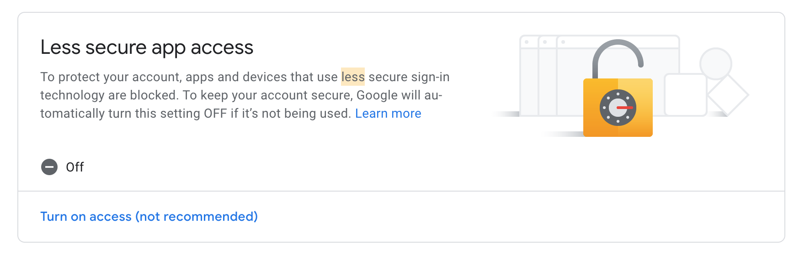

## Send E-mails from Gmail 
The `mail-sender.py` sends the e-mail from a G-Mail client to the another client. Before sending e-mails from the python code, few pre-requisites have to be done

### Pre-requisites
*   Create/Select a destination e-mail clinet.

    *   If you want to use some random e-mail address. Checkout https://www.spaml.de/ & Create a free e-mail client for some period of time.

*   User name for the login should be a complete email address Eg: username@gmail.com

*   By default, G-Mail assumes all the login connections from a code as less secure and throw smtplib.SMTPAuthenticationError. To resolve that error, do the following:

    *   Go to the G-Mail a/c in browser, Login into the a/c

    *    Go to A/c security settings : https://myaccount.google.com/security

    * Navigate to **Less secure app access**. Enable the settings to **ON** during the testing & then turn it off. 

    * 

### How to run 
*   Run this command : `python mail-sender.py`

### Note:
This code is been developed & tested in `python3`. 